#Task

Intermediate level CTF. Just enumerate, you'll get there.

You can complete this with manual enumeration, but do it as you wish

#Enumeration

We start with nmap scan for all ports.

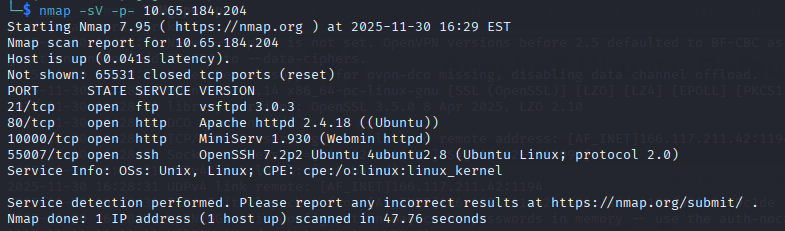

We noticed two uncommon ports.  And now we are able to answer question 2 and 3.

Question 1 requires us to login through ftp in anonymous.  Then we will find the file extention.

With using dirsearch to exploit the directory, we are able to answer the rest questions. We then keep enumeration.

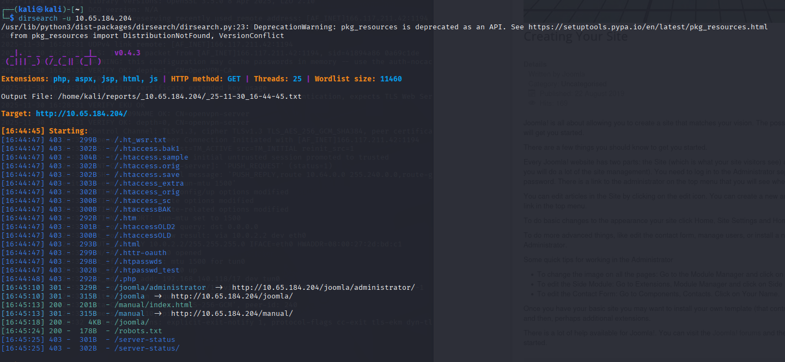

After this, we need to find the interesting file here according to the questions.

Let's use gobuster to do a deeper enumeration to the joomla.

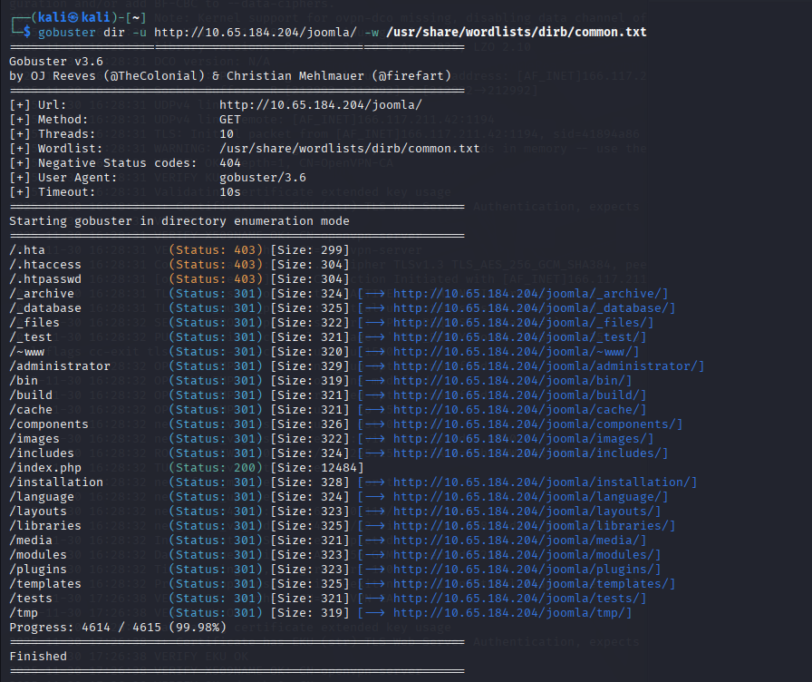

We find _test here.

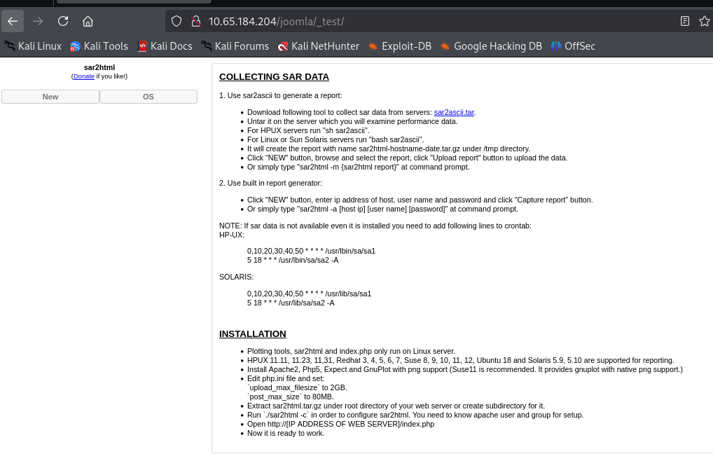

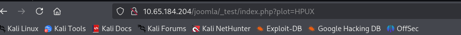

We find that plot= is the parameter here. Let's try whether we can inject or not. 

We tried to change the parameter and we see the changes here.

OS is changed to 123---we can inject.

And we remember sar2html has vulnerabilities. 

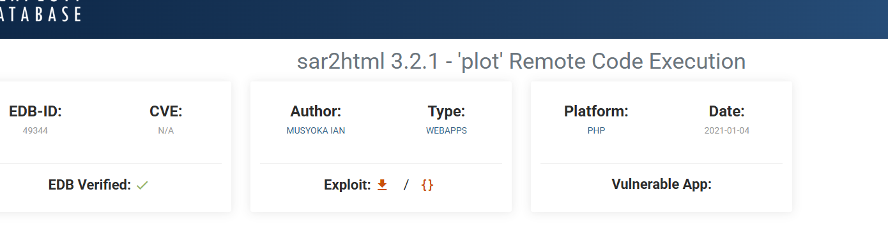

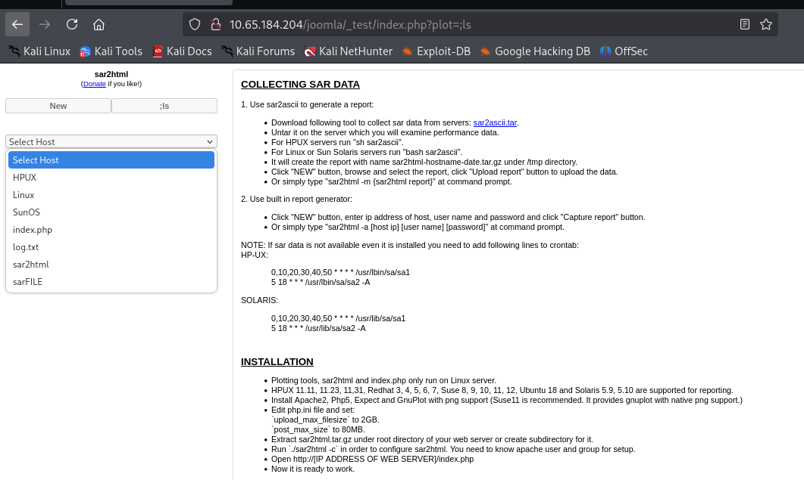

After we inject ls command, we find the interesting file here---log.txt

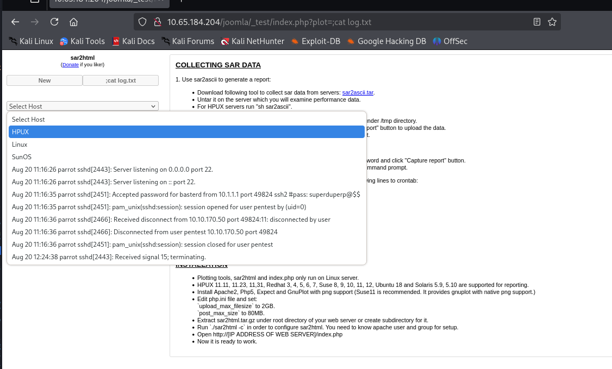

We view the content of the log.txt through cat.

Here we find possible credential.

One is basterd and its password, and another username without password called pentest

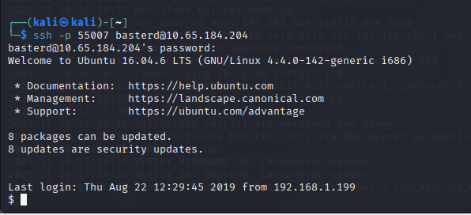

We successfully login through ssh.

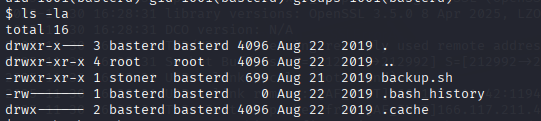

We find a file backup.sh

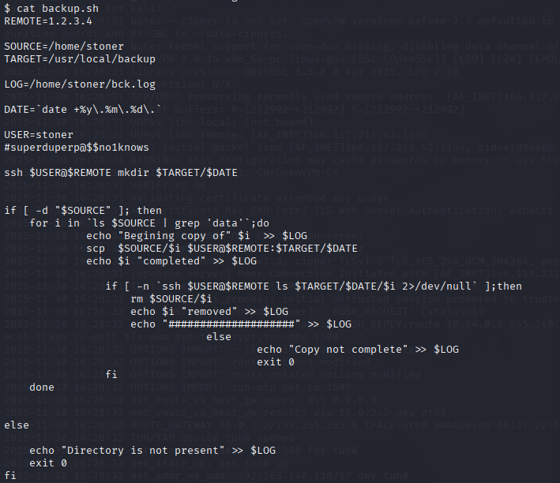

Well, we don't have write access. However, when we view the content, we find that there is a credential inside the file. Let's try this.

After we use this credential to login, we are able to find the user.txt

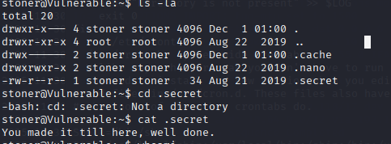

#Escalation privilege

First, try sudo -l

Lucky! 

However, after running the ls -l and sudo. We find that this is a trick.

Let's try the suid.

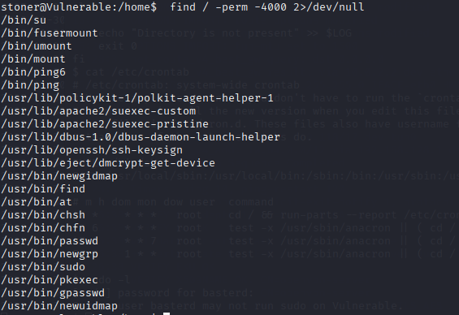

We find several files here. Let's check GTFO bins one by one.

find.md can be used to escalation privlege according to GTFO bins.

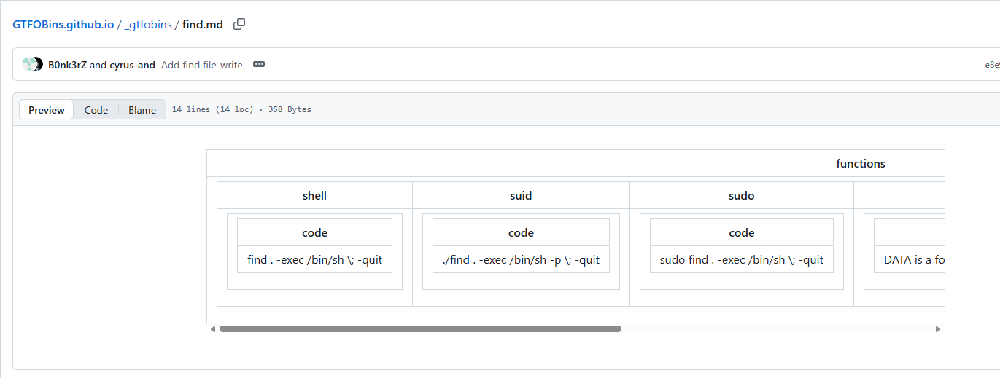

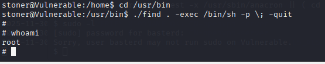

Now we are root!

Thanks for reading!

